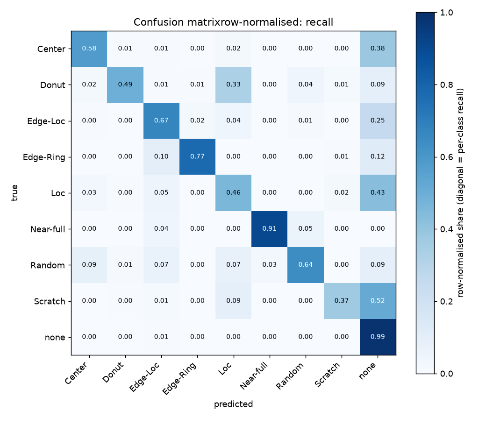
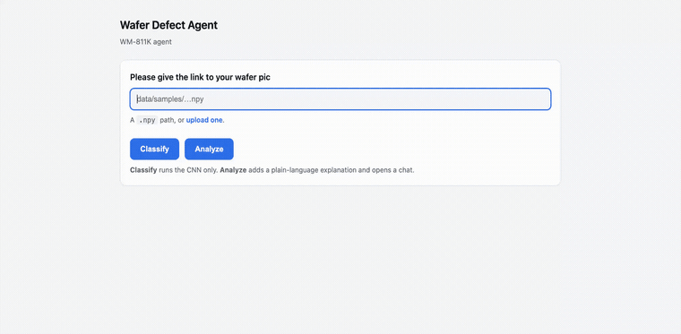

# WM-811K Wafer-Map Defect Classifier

In this project, I design a simple [CNN](#training-a-cnn) network for WM-811K data, and design an agentic chatbot to analyze the model outputs. [Jump to API](#agent-api)

## Training a CNN 

```bash
bash run.sh
```

Include the complete training and evaluation pipeline: 

1.  Download the data from  [Kaggle](https://www.kaggle.com/datasets/qingyi/wm811k-wafer-map) if data is not available locally.

2.  Preprocess the data into npz file. This step including re-sizing, trian/val/test split of the data. (train/val split is from original training dataset - 15% are splitted to the validation set.)

3.  Train the CNN model on training dataset, and record the best checkpoint evaluating on validation dataset.

4.  Evaluate the trained CNN model on test dataset.


To run one configuration by hand:

```bash
source .venv/bin/activate
export PYTHONPATH=src          # src/ holds all source code
python3 -m utils.prepare_data
python3 -m model.train
python3 -m model.eval
```

Run these from the project root, and as modules (`-m`) rather than by file path:
`src/model/model.py` would otherwise shadow the `model` package on the import
path.

## Results

Trained for 50 epochs; the checkpoint with the best validation mean-F1 was
epoch 48. Evaluated on the 118,595 test wafers, which are never seen during
training or model selection.

| split | accuracy | 
|---|---:|
| validation (8,183) | 0.9857 | 
| **test (118,595)** | **0.9607** | 


### Per class, on test

| class | recall | precision | F1 | support |
|---|---:|---:|---:|---:|
| `none` | 0.9867 | 0.9786 | 0.9827 | 110,701 |
| `Edge-Ring` | 0.7735 | 0.8701 | 0.8190 | 1,126 |
| `Near-full` | 0.9053 | 0.8866 | 0.8958 | 95 |
| `Random` | 0.6420 | 0.7466 | 0.6904 | 257 |
| `Edge-Loc` | 0.6717 | 0.6783 | 0.6750 | 2,772 |
| `Center` | 0.5817 | 0.6278 | 0.6039 | 832 |
| `Donut` | 0.4932 | 0.7660 | 0.6000 | 146 |
| `Loc` | 0.4602 | 0.6332 | 0.5330 | 1,973 |
| `Scratch` | 0.3694 | 0.4176 | 0.3920 | 693 |

Difficulty tracks geometry rather than class size. `Near-full` is the rarest
class at 95 wafers yet scores 0.8958, because it covers almost the whole wafer (easy);
`Edge-Ring` traces the rim. `Loc` and `Scratch` score worst despite having twenty
times more examples, both are small, low-contrast marks that look much like
ordinary noise on a `none` wafer.

### Confusion matrix

Rows are true classes and sum to 1, so the diagonal is per-class recall.




## Agent API

### Prepare data 

The agent API currently only support single image `npy` file, use [`src/utils/make_samples.py`](src/utils/make_samples.py) to get some wafer samples from the original dataset or convert your sample into a `npy` file.

```bash
PYTHONPATH=src python3 -m utils.make_samples
```

### Prepare the classification model 

If you don't have a trained model on wafer defect classification, a pre-trained model is available at: [Huggingface](https://huggingface.co/JingminSun/WM811KCNN).

### Setup

```bash
source .venv/bin/activate 
```

Put the API key in `.env` at the project root (git ignored, please create a find and paste the following with your API key in):

```
ANTHROPIC_API_KEY=
```

To use a different provider, set `WAFER_AGENT_MODEL` (e.g.
`WAFER_AGENT_MODEL=openai:gpt-5.5`), install that provider package, and set its key instead.

### Run the API

```bash
source .venv/bin/activate
uvicorn agent.api:app --app-dir src --reload --port 8000
```

or equivalently:

```bash
PYTHONPATH=src python3 -m agent.api
```


### Endpoints

| method | path | needs LLM key | purpose |
|---|---|---|---|
| GET | `/health` | no | liveness |
| POST | `/classify` | no | CNN only|
| POST | `/analyze` | yes | classify + plain-language explanation |
| POST | `/chat` | yes | follow-up question within an existing session |

A wafer map can be given as a **file path** (`.npy`) of the raw die codes. Wafers of any size are
accepted; they are resized to 64×64 with the same code used to build the
training set.

### Example session

For simplicity, open <http://127.0.0.1:8000> in a browser (I used `claude-code` to generate an UI interface):



Or drive it with `curl`.

Classify only, no key required:

```bash
curl -s localhost:8000/classify \
  -H 'content-type: application/json' \
  -d '{"wafer_map": "data/samples/sample20.npy"}'
```


Classify and explain, then ask a follow-up in the same session:

```bash
curl -s localhost:8000/analyze \
  -H 'content-type: application/json' \
  -d '{"wafer_map": "data/samples/sample1.npy"}'
```
The output of this should be: 

```json
  {"session_id": "abcd...", "prediction": {...}, "explanation": "..."}
```
And we can reuse the `session_id` by:

```bash
curl -s localhost:8000/chat \
  -H 'content-type: application/json' \
  -d '{"session_id": "abcd...", "question": "How does this compare to an Edge-Ring defect?"}'
```

The agent keeps per-session history, so the follow-up reuses the classification
already made instead of re-running the model.

### Without the server

Both modules are importable libraries, so call them from Python:

```bash
source .venv/bin/activate
export PYTHONPATH=src

# CNN only, no LLM key needed
python3 -c "from agent.classifier import classify; print(classify('data/samples/sample1.npy'))"

# classify + explanation, needs ANTHROPIC_API_KEY
python3 -c "from agent.wafer_agent import ask; print(ask('data/samples/sample1.npy', 'demo'))"
```

### How it works

- `src/agent/classifier.py` — loads `outputs/best.pt`, normalises any of the accepted
  input forms to a 2-D die-code array, resize it with
  `utils.prepare_data.resize_for_training`, and returns the prediction with softmax
  confidence.
- `src/agent/wafer_agent.py` — one LangChain tool, `classify_wafer_map`, wrapping the
  CNN. The agent calls it, then writes the process interpretation and
  remediation from the model's own knowledge of semiconductor manufacturing. Session state is a LangGraph `InMemorySaver` keyed on `thread_id`.
- `src/agent/api.py` — the FastAPI app.


## Folder structure

```
├── src/
│   ├── model/
│   │   ├── read_data.py     # loading, validation split, class balancing
│   │   ├── model.py         # the CNN
│   │   ├── train.py         # training loop, model selection
│   │   └── eval.py          # testing metrics, confusion matrix plotting
│   ├── agent/
│   │   ├── classifier.py    # inference: .npy in, predicted class + confidence out
│   │   ├── wafer_agent.py   # LangChain agent wrapping the classifier as a tool
│   │   ├── api.py           # FastAPI app: /classify, /analyze, /chat, and the UI
│   │   └── ui.html          # the single-page chat UI served at /
│   └── utils/
│       ├── prepare_data.py  # pkl -> npz: filter, resize, split flags (train/test)
│       └── make_samples.py  # pull held-out wafers from the pkl into data/samples/
├── data_analyze.ipynb       # dataset analyze
├── requirements.txt         # dependencies
├── run.sh                   # the trainingpipeline
```
